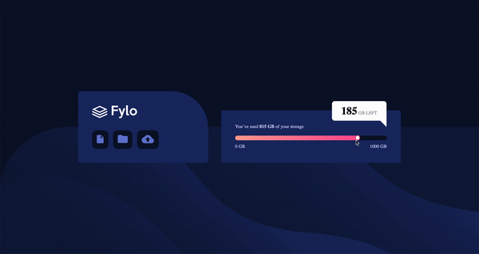
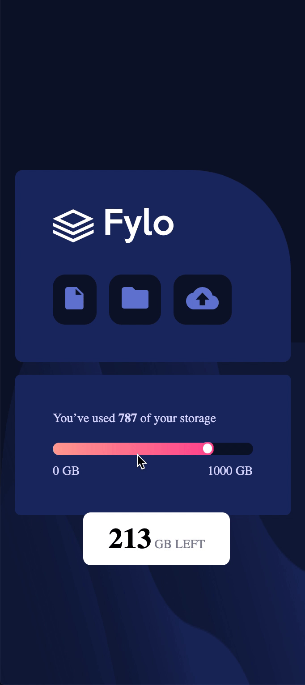

# Welcome! 👋

This website is a model created to represent a database with a storage component, it shows how much storage have been used and how much left.
 
You can checkout the demo here : <strong><a href="https://gustavomatsunaga.github.io/dataStorageComponent/" target="_blank">Data Storage Component</a></strong>

## Challenges! :pushpin:

This website was made using only HTML5, SASS and Javascript. The most dificult challenge was to make the input type range as close as the model. The input type range was made with a linear-gradient background, so it changes the color whenever the person drags the input.

**Let's have fun!** 🚀

- [x] Building it to look as cloose as the design.
- [x] View the optimal layout for the component depending on their device's screen size (Responsive Web Design)
- [x] Use ID and classes in the elements
- [x] Use query selectors in Javascript
- [x] DOM manipulation with Javascript

## Technologies! :computer:

<ul>
    <li>HTML</li>
    <li>SASS</li>
    <li>JAVASCRIPT</li>
</ul>

# Web Model

## Desktop

## Mobile

# Credits :star2:
Designed by Gustavo Matsunaga! :octocat:

:gem: <a href="https://www.linkedin.com/in/gustavo-matsunaga-0628461a3/"><strong>Linkedin</a>